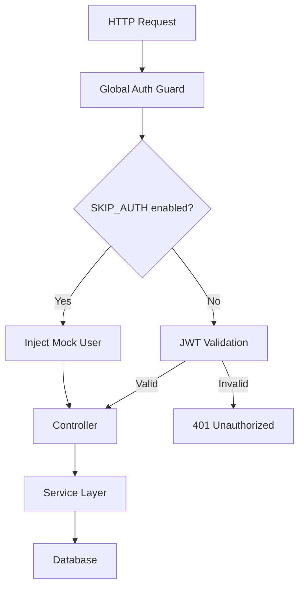
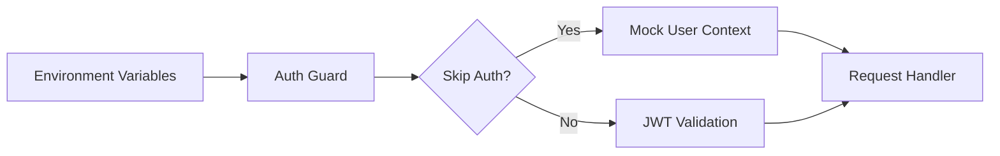

## Product Overview

优化现有 NestJS 后端项目的 JWT 认证机制，使其在开发环境下可选择性跳过认证，并建立完整的 E2E 测试体系确保 API 流程可正常运行。

## Core Features

- **环境变量控制认证跳过**: 通过环境变量 `SKIP_AUTH` 控制是否在开发环境跳过 JWT 认证
- **全局认证守卫优化**: 修改现有 JWT Guard，支持根据环境变量自动跳过认证检查
- **模拟用户注入**: 认证跳过时自动注入模拟用户信息，确保业务逻辑正常运行
- **E2E 测试套件**: 使用 vitest 创建完整的 E2E 测试用例，覆盖主要 API 端点
- **测试辅助工具**: 提供测试用的 mock 数据和辅助函数

## Tech Stack

- 后端框架: NestJS (TypeScript)
- 认证: JWT + Passport
- 测试框架: Vitest
- HTTP 测试: Supertest
- 环境配置: dotenv / @nestjs/config

## Architecture Design

### System Architecture

采用分层架构，在认证层添加环境感知的条件判断逻辑。



### Module Division

- **Auth Module**: 认证守卫优化，环境变量检测
- **Config Module**: 环境变量管理
- **Test Module**: E2E 测试配置和用例

### Data Flow



## Implementation Details

### Core Directory Structure

```
src/
├── auth/
│   ├── guards/
│   │   └── jwt-auth.guard.ts    # 优化认证守卫
│   ├── decorators/
│   │   └── public.decorator.ts  # 现有公开路由装饰器
│   └── constants/
│       └── mock-user.ts         # 模拟用户数据
├── config/
│   └── auth.config.ts           # 认证配置
test/
├── e2e/
│   ├── setup.ts                 # 测试环境配置
│   ├── app.e2e-spec.ts          # 应用级 E2E 测试
│   └── api/
│       ├── auth.e2e-spec.ts     # 认证相关测试
│       └── *.e2e-spec.ts        # 其他 API 测试
├── helpers/
│   └── test-utils.ts            # 测试辅助函数
└── vitest.config.e2e.ts         # E2E 测试配置
```

### Key Code Structures

```typescript
// 环境变量配置
interface AuthConfig {
  skipAuth: boolean;
  jwtSecret: string;
}

// Mock 用户结构
interface MockUser {
  id: string;
  openid: string;
  role: string;
}

// 优化后的 Guard 逻辑
@Injectable()
class JwtAuthGuard extends AuthGuard('jwt') {
  canActivate(context: ExecutionContext): boolean {
    if (this.configService.get('SKIP_AUTH') === 'true') {
      // 注入 mock user 到 request
      return true;
    }
    return super.canActivate(context);
  }
}
```

### Technical Implementation Plan

1. **环境变量配置**: 添加 `SKIP_AUTH` 环境变量，在 `.env.development` 中配置
2. **Guard 优化**: 修改 JWT Guard 支持条件跳过
3. **Mock 用户注入**: 创建标准化的 mock 用户数据
4. **E2E 测试配置**: 配置 vitest E2E 测试环境
5. **测试用例编写**: 覆盖核心 API 端点的测试用例

## Agent Extensions

### SubAgent

- **code-explorer**
- Purpose: 探索现有项目结构，查找认证相关代码（guards、decorators、auth module）和现有配置
- Expected outcome: 获取完整的认证实现细节，包括 JWT Guard 位置、@Public 装饰器实现、现有 devLogin 接口代码