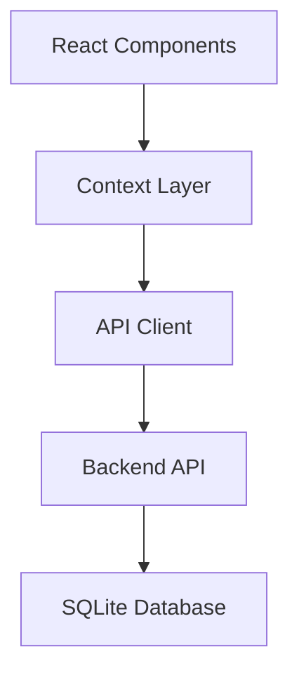
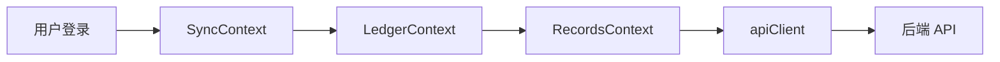

## Product Overview

重构 Web 端应用，对齐小程序功能架构，移除本地存储和自动同步功能，改为直接使用后端 API 进行数据操作。

## Core Features

- **API 直连模式**: 移除本地存储，所有数据操作直接调用后端 API
- **简化认证流程**: 保留手机号登录，移除复杂的同步配置
- **账本自动创建**: 新用户登录后自动创建默认账本
- **统一数据流**: Context 直接管理 API 调用和状态更新
- **TypeScript E2E 测试**: 使用 Playwright 编写完整的端到端测试

## Tech Stack

- 前端框架: React 18 + TypeScript
- 构建工具: Vite
- UI 组件: Tailwind CSS + Radix UI (shadcn/ui)
- 状态管理: React Context
- HTTP 客户端: Fetch API (apiClient)
- 测试框架: Playwright
- 后端: NestJS + SQLite

## Architecture Design

### System Architecture

采用简化的三层架构，移除本地存储层。



### Module Division

- **SyncContext**: 认证状态管理（登录/登出）
- **LedgerContext**: 账本状态管理，依赖 SyncContext
- **RecordsContext**: 记录状态管理，依赖 LedgerContext
- **apiClient**: 统一的 API 调用封装

### Data Flow



## Implementation Details

### Core Directory Structure

```
apps/web/src/
├── context/
│   ├── SyncContext.tsx      # 认证上下文（简化版）
│   ├── LedgerContext.tsx    # 账本上下文
│   └── RecordsContext.tsx   # 记录上下文
├── services/
│   └── apiClient.ts         # API 客户端
├── pages/
│   ├── LoginPage.tsx        # 登录页
│   ├── HomePage.tsx         # 首页
│   ├── RecordFormPage.tsx   # 记账表单页
│   ├── RecordsPage.tsx      # 账单列表页
│   └── ProfilePage.tsx      # 个人中心页
├── components/
│   ├── layout/              # 布局组件
│   ├── common/              # 通用组件
│   └── ui/                  # UI 基础组件
└── App.tsx                  # 应用入口
```

### Key Code Structures

```typescript
// SyncContext - 简化的认证上下文
interface AuthContextType {
  isAuthenticated: boolean
  isLoading: boolean
  user: User | null
  error: string | null
  login: (phone: string) => Promise<boolean>
  logout: () => void
}

// LedgerContext - 账本上下文
interface LedgerContextType {
  ledgers: Ledger[]
  currentLedger: Ledger | null
  isLoading: boolean
  createLedger: (name: string) => Promise<Ledger>
  switchLedger: (id: string) => void
  deleteLedger: (id: string) => Promise<boolean>
  refreshLedgers: () => Promise<void>
}

// RecordsContext - 记录上下文
interface RecordsContextType {
  records: Record[]
  statistics: Statistics
  isLoading: boolean
  addRecord: (data: RecordData) => Promise<void>
  updateRecord: (id: string, data: Partial<Record>) => Promise<void>
  deleteRecord: (id: string) => Promise<void>
  refreshData: () => Promise<void>
}
```

### 已完成的改动

1. **SyncContext.tsx**: 简化为纯认证上下文，移除同步相关功能
2. **LedgerContext.tsx**: 监听 `isAuthenticated` 状态，登录后自动加载账本，无账本时自动创建
3. **RecordsContext.tsx**: 直接调用 API，移除本地存储逻辑
4. **RecordFormPage.tsx**: 等待账本加载完成后才能保存记录
5. **RecordsPage.tsx**: 简化删除逻辑，移除云端同步选项
6. **ProfilePage.tsx**: 简化为账本管理和退出登录功能

### 已删除的文件

- `services/ledgerService.ts` - 本地账本服务
- `services/recordService.ts` - 本地记录服务
- `components/sync/SyncSettings.tsx` - 同步设置组件
- `components/sync/SyncStatusBar.tsx` - 同步状态栏组件
- `pages/OnboardingPage.tsx` - 引导页
- `e2e/sync.spec.ts` - 同步测试文件

## E2E Testing

### 测试配置

```typescript
// playwright.config.ts
export default defineConfig({
  testDir: './e2e',
  use: {
    baseURL: 'http://localhost:5173',
    ...devices['Pixel 5'],
  },
  webServer: {
    command: 'pnpm dev',
    url: 'http://localhost:5173',
  },
})
```

### 测试覆盖

| 测试模块 | 测试用例数 | 说明 |
|---------|-----------|------|
| 登录功能 | 3 | 登录页显示、成功登录、保持登录状态 |
| 首页功能 | 1 | 首页元素显示 |
| 记账功能 | 4 | 添加支出/收入、表单验证、日期选择 |
| 账单列表 | 2 | 列表显示、月份切换 |
| 统计分析 | 2 | 统计数据显示、Tab 切换 |
| 导航功能 | 3 | 底部导航、记账导航、返回按钮 |
| 编辑记录 | 1 | 编辑已有记录 |
| 删除记录 | 1 | 删除记录确认 |
| 个人中心 | 4 | 页面显示、账本管理、创建账本、退出登录 |
| 完整流程 | 1 | 端到端完整用户流程 |
| 响应式布局 | 1 | 移动端布局 |

### 运行测试

```bash
# 启动后端
cd apps/backend && pnpm dev

# 运行测试
cd apps/web && pnpm test:e2e
```

## 与小程序的对齐

| 功能模块 | Web 端 | 小程序端 |
|---------|--------|---------|
| 认证 | SyncContext | services/storage.ts |
| 账本管理 | LedgerContext | services/ledger.ts |
| 记录管理 | RecordsContext | services/record.ts |
| 数据存储 | 后端 API | wx.setStorageSync + 后端 API |
| 统计计算 | RecordsContext | business-logic/statistics.ts |

## Agent Extensions

### SubAgent

- **code-explorer**
- Purpose: 探索项目结构，查找需要修改的文件
- Expected outcome: 获取完整的文件列表和代码结构
